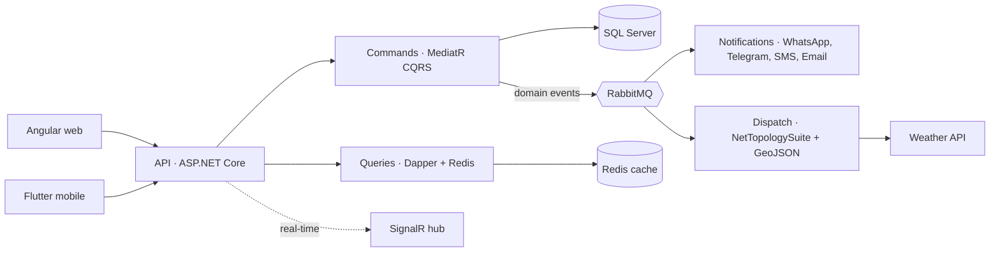

<!-- Profile README · Nawaf Mahsoun · brand colors: #0D1117 bg · #5EEAD4 teal · #818CF8 indigo -->

<div align="center">


<a href="https://github.com/NawafMahs">
  
</a>

<p>
  <a href="https://www.linkedin.com/in/nawafmahsoun"></a>
  <a href="mailto:nawafmahsoun11@gmail.com"></a>
  
</p>


</div>


### ⚡ Recruiter quick scan

<div align="center">

| 🎯 Role | 🧑‍💻 Experience | 🛠️ Core stack | 🌍 Location | 📅 Availability |
|:---:|:---:|:---:|:---:|:---:|
| Senior AI-Native Software Engineer<br/><sub>.NET Backend · Distributed Systems</sub> | **5+ years**<br/><sub>GovTech · NGO · Enterprise</sub> | C# · ASP.NET Core · Azure<br/><sub>DDD · CQRS · RabbitMQ · Redis</sub> | Syria · UTC+3<br/><sub>Remote / Hybrid</sub> | Open to senior roles<br/><sub>Replies within 24h</sub> |

<sub><b>Keywords:</b> Senior .NET Engineer · Senior Backend Engineer · AI-Native Software Engineer · Agentic Engineering · Spec-Driven Development · Azure Developer · Microservices · Event-Driven Architecture · Clean Architecture · GovTech</sub>

</div>

---

### 👋 About me

I build **backend systems that governments depend on when it matters most**.

- 🚑 **Now:** Senior .NET Developer at the **Ministry of Emergency and Disaster Management (The White Helmets)**, architecting a national Emergency Management System and ministry ERP for **2,000,000+ users**.
- 🏛️ **Before:** ERP platforms for **2 national ministries** in Lebanon and Jordan, serving 5,000+ users and **20,000+ regulatory requests a month**.
- 🤖 **How I work:** AI-native. Claude, Cursor agents and Copilot handle exploration, refactoring and test generation. Judgment, review and the quality bar stay human.
- 🌍 Syria · Remote · UTC+3 · Arabic & English

### 📊 Impact in numbers

<div align="center">

| <h2>2M+</h2> | <h2>40%</h2> | <h2>70%</h2> | <h2>50%</h2> | <h2>85%+</h2> |
|:---:|:---:|:---:|:---:|:---:|
| users on systems I architect | faster API responses<br/><sub>SQL Server tuning + Redis</sub> | less deployment effort<br/><sub>Azure DevOps CI/CD</sub> | faster feature delivery<br/><sub>AI-assisted workflows</sub> | automated test coverage<br/><sub>xUnit + Moq</sub> |

</div>

---

### 🚀 Featured work

<sub>Click any project to expand the details.</sub>

<details open>
<summary><b>🚑 National Emergency Management System & Ministry ERP</b> · Ministry of Emergency and Disaster Management · <code>Dec 2025 → now</code></summary>
<br/>

Real-time incident dispatch and ministry operations for **2,000,000+ users** across Syria.

`.NET 9` `ASP.NET Core` `DDD` `Clean Architecture` `CQRS` `RabbitMQ` `SignalR` `Redis` `SQL Server` `Azure DevOps` `Sentry`

- 🗺️ Geospatial dispatch with **NetTopologySuite + GeoJSON** and weather-forecast integration
- 📣 Multi-channel alerts: **WhatsApp, Telegram, SMS, SendGrid**
- ⚡ **40% faster APIs** through SQL Server tuning and Redis caching
- 📱 REST APIs consumed by **Angular** web and **Flutter** mobile clients

</details>


<details>
<summary><b>🧭 Architecture of the Emergency Management System</b> · click to open the diagram</summary>
<br/>



</details>

<details>
<summary><b>🏛️ Government ERP & Regulatory Platforms</b> · Cloud Systems SARL · Lebanon & Jordan</summary>
<br/>

ERP platforms for the **Lebanese Ministry of Economy & Trade** and the **Jordanian Ministry of Social Development**.

`.NET 8` `C#` `Razor Pages` `Clean Architecture` `EF Core` `Dapper` `SQL Server` `MySQL` `JWT` `MediatR` `FluentValidation`

- 👥 **5,000+ government users**, **20,000+ regulatory requests per month**
- ✅ Digital approval workflows that cut manual processing by **60%**
- 💳 **Visa and Mastercard** payment gateway integration
- 🔐 JWT-secured REST APIs with Swagger/OpenAPI

</details>

<details>
<summary><b>🔥 Enterprise Heating-Machine Management Platform</b> · SWB · Lead .NET Developer</summary>
<br/>

Full-cycle platform for **10,000+ users**, with real-time monitoring dashboards.

`ASP.NET Core` `EF Core` `Dapper` `SQL Server` `Blazor` `CI/CD`

- ⚡ **30% faster** system performance through database optimization and caching
- 🚀 **70% less deployment effort** with CI/CD, keeping **85%+ test coverage**
- 🧑‍🏫 Mentored junior developers on SOLID, CQRS, MediatR and production readiness

</details>

<details>
<summary><b>🤖 AI-Native & Agentic Engineering</b> · how I ship</summary>
<br/>

`Claude Code` `Claude AI` `Cursor Agents` `GitHub Copilot` `GitHub Spec Kit` `MCP`

My loop is **spec-driven**: a reviewed spec comes first, then agents do the heavy lifting.

```text
specify  →  plan  →  tasks  →  implement  →  human review  →  tests  →  ship
```

| Stage | What AI agents do | What stays human |
|---|---|---|
| Specify & plan | Explore the codebase, map impact, draft specs and ADRs | Pick the trade-off, confirm scope with the business |
| Build | Scaffold handlers, mappings and migrations across files | Domain modeling and boundaries |
| Refactor | Propose multi-file changes | Review every diff |
| Test & debug | Generate xUnit cases, trace logs, write diagnostic scripts | Decide what "correct" means |

**Result:** feature delivery cycles cut by about **50%** without lowering the quality bar.

</details>

---

### 🔬 Engineering case studies

<sub>Real problems from production work, described without confidential details.</sub>

<details>
<summary><b>🧊 Killing a 30-second cold start</b> · Azure SQL Serverless · App Service · EF Core</summary>
<br/>

**Problem:** creating an incident in an emergency system sometimes took **~33 seconds** instead of the usual **~1.2 s**.

**Investigation:** traced code, logs and Sentry data across two weeks and found **45 transient-connection retry events**. It wasn't a code bug. The root cause was an infrastructure interaction: **Azure SQL Serverless auto-pause** plus an App Service worker unloading when idle, which also stopped the background keep-alive.

**Fix plan:** enable *Always On*, tune or disable auto-pause, add a health-check endpoint and a staging slot, and move database migrations out of app startup. I also wrote a PowerShell diagnostic script so the team can check the environment in one run.

`.NET` `EF Core` `Azure SQL` `Azure App Service` `Redis` `Sentry` `PowerShell`

</details>

<details>
<summary><b>🧩 One-to-many → many-to-many, without breaking anything</b> · Spec-driven refactor · EF Core · CQRS</summary>
<br/>

**Problem:** the business needed each evaluation record to link to **many** assessment criteria instead of one, touching the data model, scoring and API.

**Approach:** mapped the full impact across the codebase and the linked tickets before writing code:
- New join entity with a composite key, EF Core configuration and migration
- Updated CQRS commands, validators, handlers, DTOs and queries
- Flagged the score recalculation logic and a missing "edit" requirement early
- Shared an impact map with both engineers and business stakeholders

**AI-native workflow:** turned the analysis into **GitHub Spec Kit** prompts (`specify → plan → tasks → implement`) for backend and frontend, so the build is driven by a reviewed spec.

`.NET` `EF Core` `SQL Server` `Clean Architecture` `CQRS` `MediatR` `Spec Kit`

</details>

---

### 🧰 Tech stack

<div align="center">


</div>

<details>
<summary><b>See the full stack by area</b></summary>
<br/>

| Area | Tools |
|---|---|
| **Backend** | C#, ASP.NET Core (.NET 8/9), Web API, EF Core, Dapper, LINQ, MediatR, FluentValidation, SignalR, Blazor, .NET Aspire |
| **Architecture** | Clean Architecture, DDD, CQRS, Microservices, Event-Driven Architecture, SOLID |
| **Data** | SQL Server, T-SQL, query optimization, Redis, MySQL, NetTopologySuite |
| **Cloud & DevOps** | Microsoft Azure, App Services, Azure DevOps CI/CD, Azure AD/SSO, Docker, Kubernetes, Application Insights, Sentry |
| **Integrations** | REST, OpenAPI/Swagger, RabbitMQ, OAuth 2.0, JWT, payment gateways, WhatsApp, Telegram, SMS, SendGrid, Firebase |
| **Testing** | xUnit, NUnit, Moq, integration testing, code reviews |
| **AI-assisted** | Claude AI, Cursor agents, GitHub Copilot |

</details>

---

### 🐍 Contribution activity

<div align="center">


<sub>Most of my production work lives in private government and NGO repositories.</sub>

</div>

---

### 🎓 Credentials

<div align="center">

| 🏅 **Microsoft Certified: Azure Developer Associate** | 🎓 **B.Sc. Information Technology** · Ebla Private University |
|:---:|:---:|

</div>

### 💭 How I think

```csharp
public sealed class Nawaf : ISoftwareEngineer
{
    public string Mission => "Build software that keeps working when people need it most.";

    public IReadOnlyList<string> Principles =>
    [
        "Clean code is a duty to whoever maintains it next.",
        "The best architecture is the one your team can reason about at 3 AM.",
        "AI amplifies engineers. It doesn't replace judgment.",
        "In an emergency system, every millisecond matters."
    ];

    public void OnNewChallenge() => Console.WriteLine("Let's build it.");
}
```

---

<div align="center">

### 🤝 Let's work together

Open to **senior backend** and **AI-native engineering** roles · **Remote or hybrid**<br/>
<sub>GovTech · International NGOs & UN agencies · Product companies on .NET / Azure</sub>

<a href="https://www.linkedin.com/in/nawafmahsoun"></a>
<a href="mailto:nawafmahsoun11@gmail.com"></a>
<a href="https://gitlab.com/nawafmahsoun11"></a>


</div>
